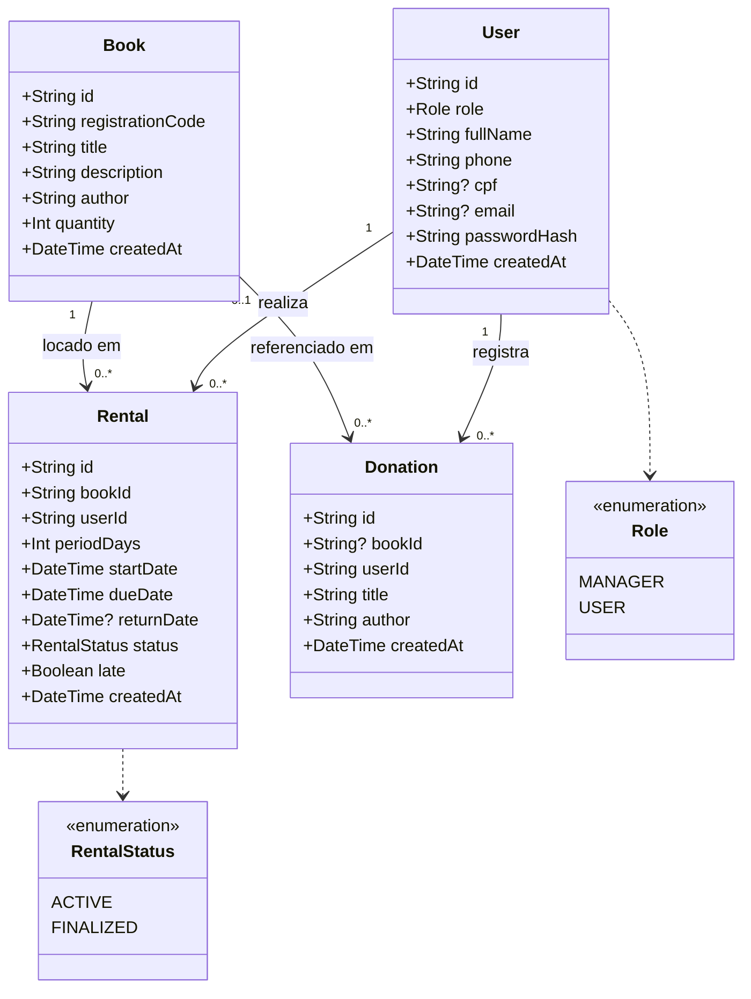

# Diagrama de Entidades

Representação das entidades de domínio BiblioFlow com atributos, tipos e enumerações.

---

## Descrição detalhada

### User

Representa um usuário autenticado. Os perfis `MANAGER` e `USER` compartilham a mesma tabela; o campo de identificação difere por perfil.

| Campo | Tipo | Restrição |
|---|---|---|
| `id` | UUID | PK; gerado automaticamente |
| `role` | `MANAGER \| USER` | Obrigatório |
| `fullName` | string | Obrigatório |
| `phone` | string | Obrigatório |
| `cpf` | string? | Único; obrigatório para `USER`; nulo para `MANAGER` |
| `email` | string? | Único; obrigatório para `MANAGER`; nulo para `USER` |
| `passwordHash` | string | Hash bcrypt (10 rounds); nunca exposto na API |
| `createdAt` | datetime | Gerado automaticamente |

### Book

Representa um título no acervo. O campo `quantity` indica quantos exemplares físicos existem — o estoque de locações é controlado por ele.

| Campo | Tipo | Restrição |
|---|---|---|
| `id` | UUID | PK; gerado automaticamente |
| `registrationCode` | string | Único; formato `BIB-<base36>-<hex>`; gerado pelo servidor; imutável |
| `title` | string | Obrigatório |
| `description` | string | Obrigatório |
| `author` | string | Obrigatório |
| `quantity` | int | Mínimo 1; controla a disponibilidade para locação |
| `createdAt` | datetime | Gerado automaticamente |

### Rental

Representa um empréstimo ativo ou finalizado de um exemplar para um usuário.

| Campo | Tipo | Restrição |
|---|---|---|
| `id` | UUID | PK; gerado automaticamente |
| `bookId` | UUID | FK → `Book`; obrigatório |
| `userId` | UUID | FK → `User`; obrigatório |
| `periodDays` | int | Somente `15`, `30` ou `45` — rejeitado por Zod para qualquer outro valor |
| `startDate` | datetime | Data de início; definida pelo servidor no momento da criação |
| `dueDate` | datetime | `startDate + periodDays`; calculado pelo servidor; nunca aceito do cliente |
| `returnDate` | datetime? | Nulo enquanto `ACTIVE`; preenchido na finalização |
| `status` | `ACTIVE \| FINALIZED` | Padrão: `ACTIVE`; transição é unidirecional |
| `late` | boolean | `true` se `returnDate > dueDate`; calculado automaticamente na finalização |
| `createdAt` | datetime | Gerado automaticamente |

### Donation

Registra uma doação de livro ao acervo. O `bookId` é opcional pois o livro doado pode ainda não constar no catálogo — o gestor pode catalogá-lo depois.

| Campo | Tipo | Restrição |
|---|---|---|
| `id` | UUID | PK; gerado automaticamente |
| `bookId` | UUID? | FK → `Book`; opcional |
| `userId` | UUID | FK → `User`; obrigatório — qualquer perfil autenticado pode doar |
| `title` | string | Título informado pelo doador |
| `author` | string | Autor informado pelo doador |
| `createdAt` | datetime | Gerado automaticamente |
