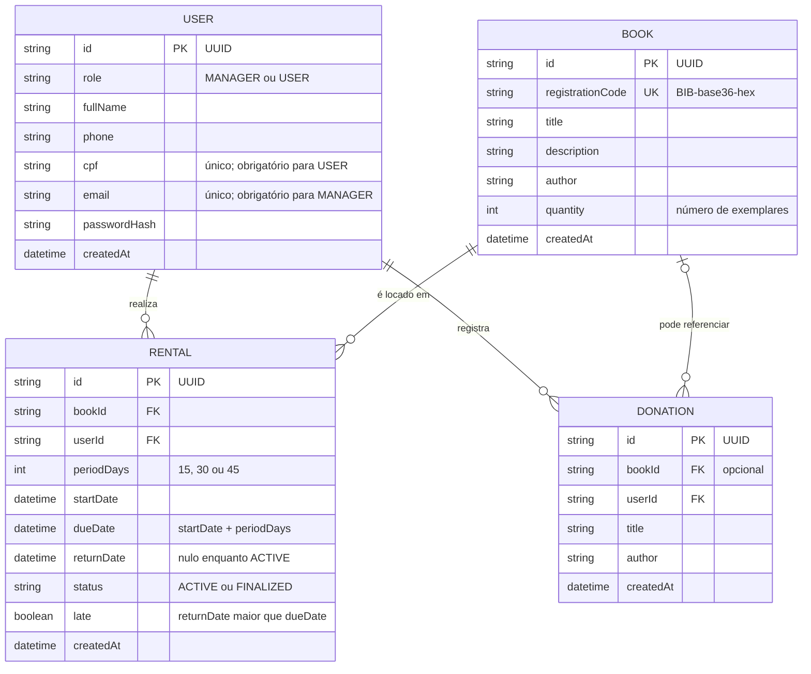

# Diagrama Entidade-Relacionamento

Modelo de dados do BiblioFlow derivado de `prisma/schema.prisma`.

---

## Cardinalidades

| Relação | Cardinalidade | Regra de negócio |
|---|---|---|
| `User → Rental` | 1 para N | Um usuário pode ter várias locações ao longo do tempo; máximo de `MAX_RENTALS_PER_USER` ativas simultaneamente (padrão: 3) |
| `Book → Rental` | 1 para N | Um livro pode ser locado múltiplas vezes (sequencialmente); locações ativas simultâneas limitadas a `Book.quantity` |
| `User → Donation` | 1 para N | Um usuário pode registrar várias doações |
| `Book → Donation` | 0..1 para N | Uma doação pode ou não referenciar um livro já existente no catálogo |

---

## Restrições de integridade

- `registrationCode` é imutável após criação e nunca aceito como input do cliente — gerado pelo servidor no formato `BIB-<base36>-<hex>`.
- `cpf` e `email` são mutuamente exclusivos por perfil: `USER` usa CPF, `MANAGER` usa e-mail.
- `periodDays` aceita somente `15`, `30` ou `45` — validado por Zod antes de atingir o banco.
- Locações `ACTIVE` para um livro não podem exceder `Book.quantity`.
- Um usuário não pode ter mais de `MAX_RENTALS_PER_USER` locações `ACTIVE` simultâneas.
- Um livro não pode ser excluído enquanto possuir locações `ACTIVE`.
