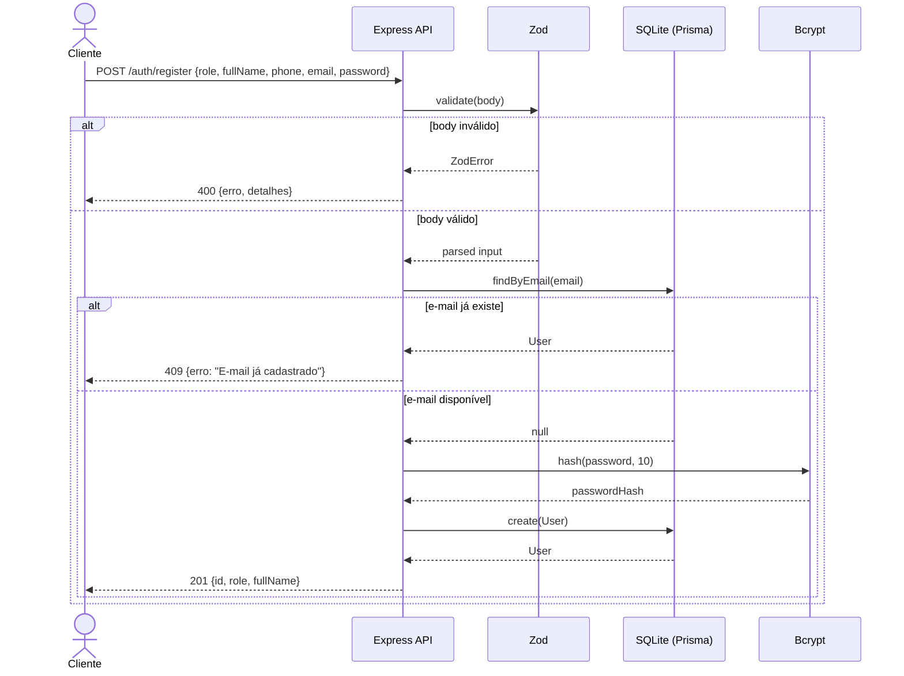
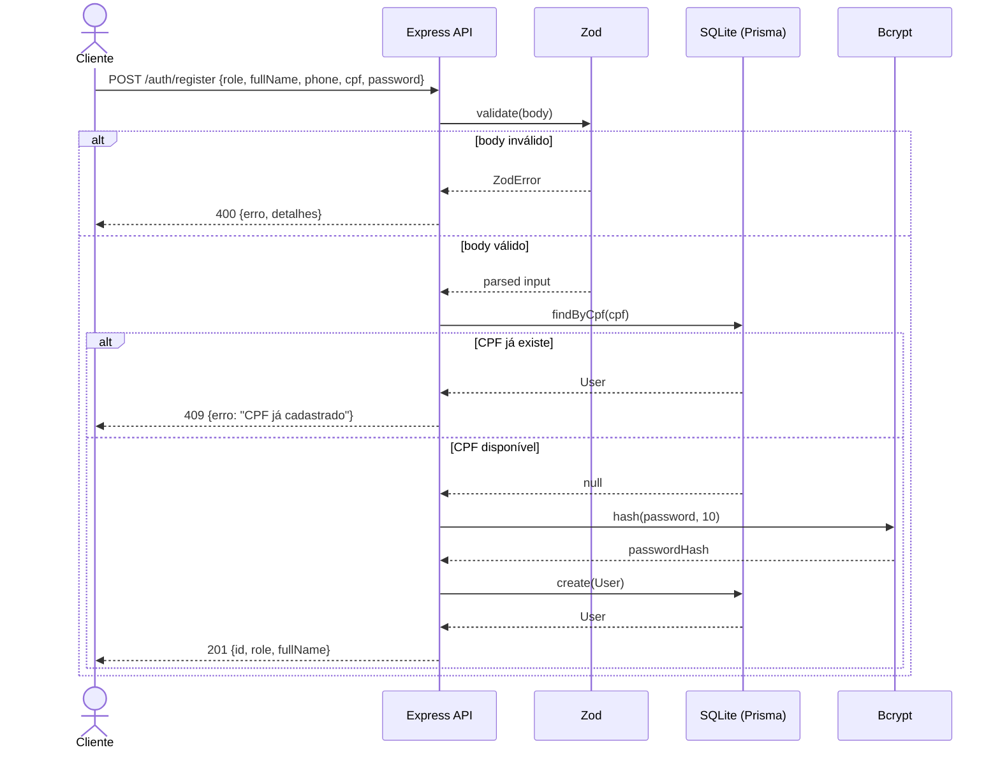
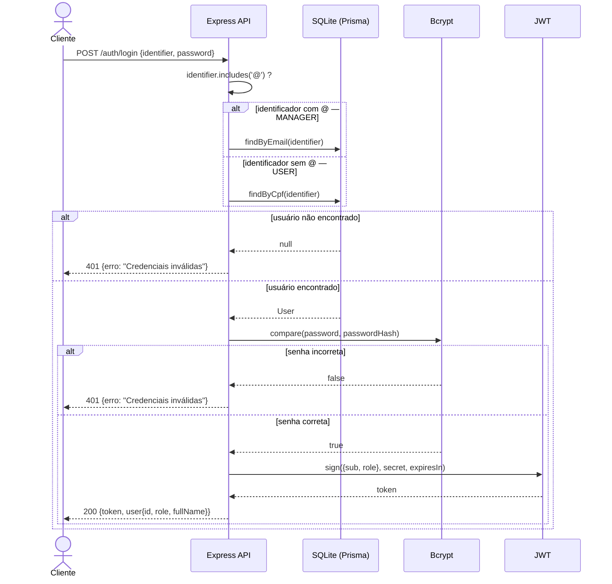
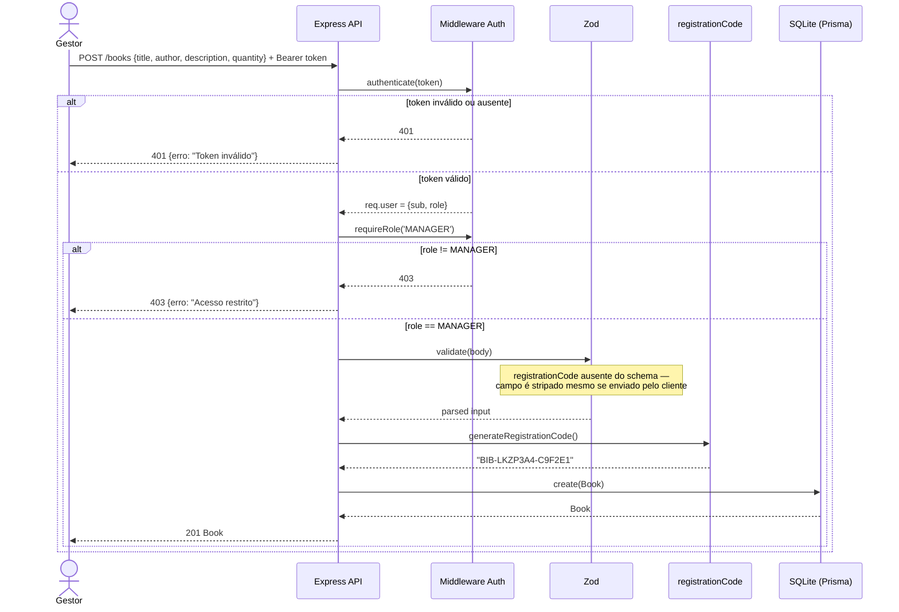
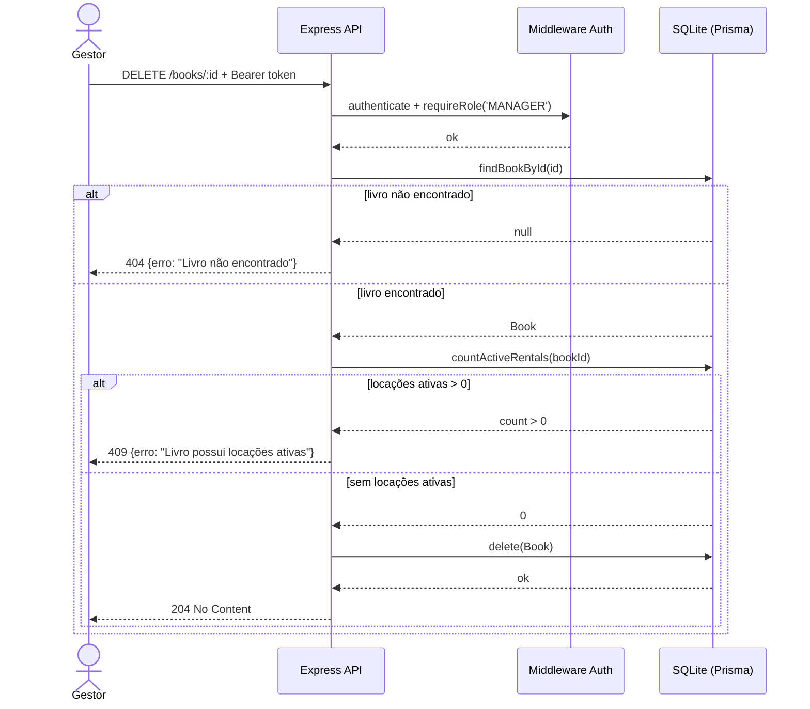
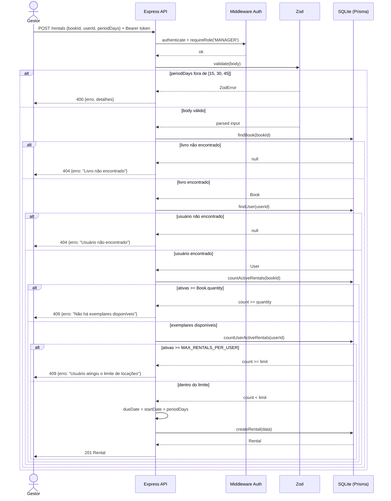
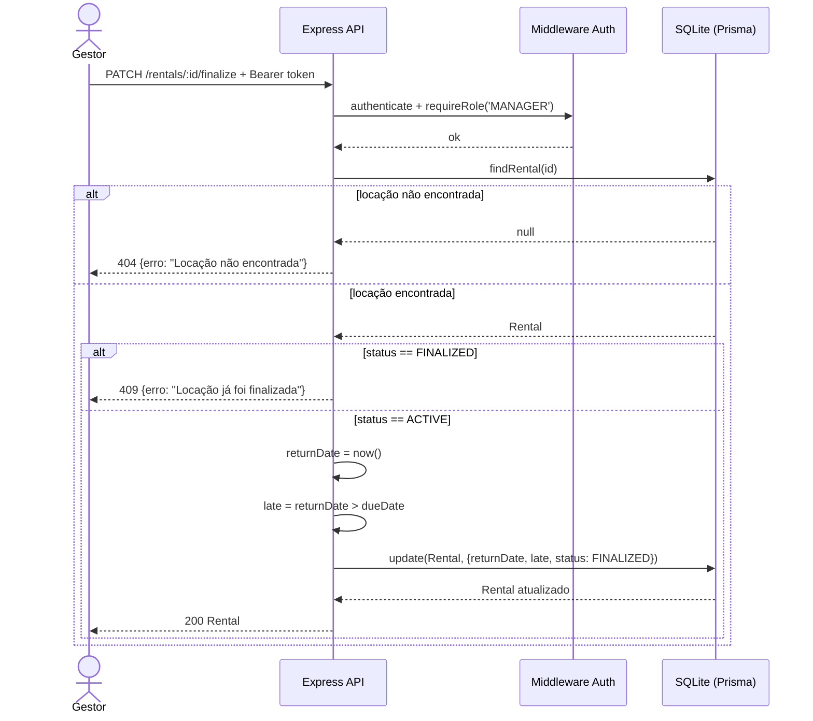
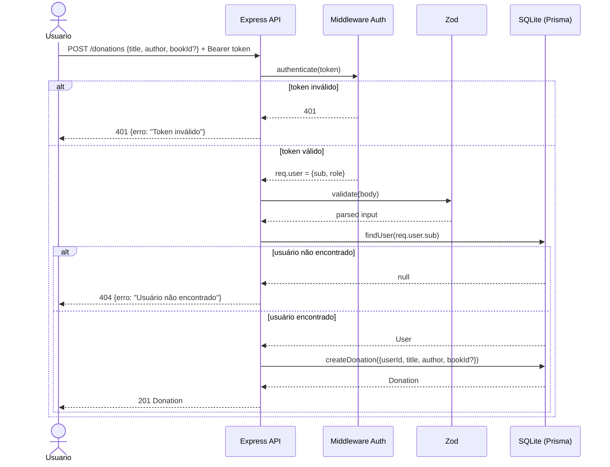
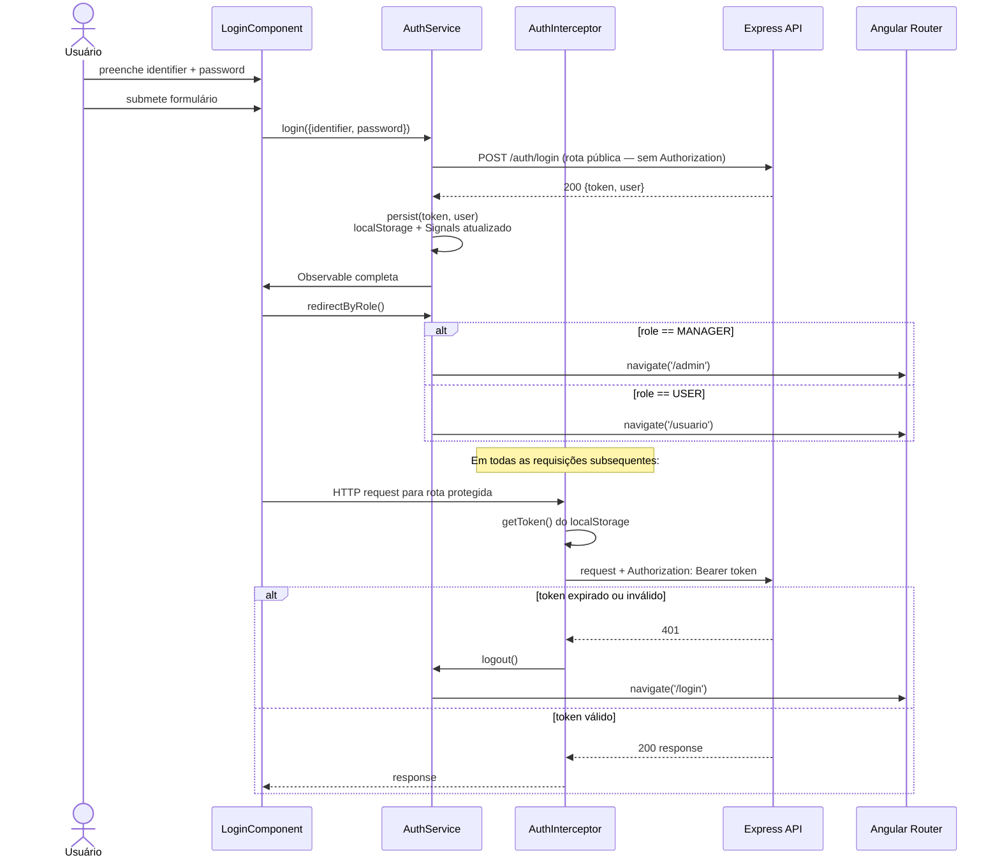
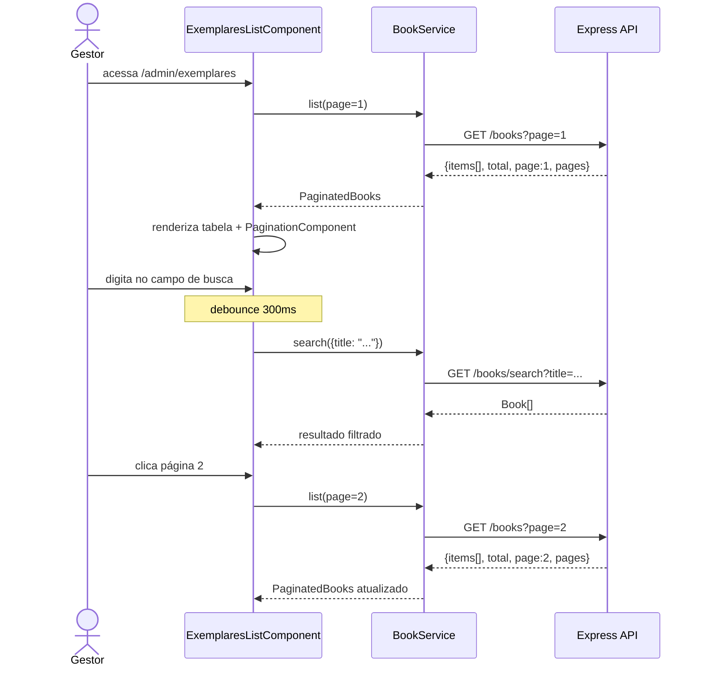

# Diagramas de Sequência

Fluxos principais do BiblioFlow entre as camadas: **Cliente / Frontend Angular → API (Express) → Banco de dados (SQLite via Prisma)**.

---

## 1. Registro — MANAGER

`POST /api/v1/auth/register` com `role: "MANAGER"`.

---

## 2. Registro — USER

`POST /api/v1/auth/register` com `role: "USER"`. Idêntico ao MANAGER, mas valida CPF em vez de e-mail.

---

## 3. Login

`POST /api/v1/auth/login`. O backend detecta automaticamente se o identificador é e-mail (MANAGER) ou CPF (USER) pela presença de `@`.

---

## 4. Criar livro

`POST /api/v1/books` — requer MANAGER.

---

## 5. Excluir livro (com bloqueio por locação ativa)

`DELETE /api/v1/books/:id` — requer MANAGER.

---

## 6. Criar locação

`POST /api/v1/rentals` — requer MANAGER. Aplica quatro validações de negócio em sequência.

---

## 7. Finalizar locação (devolução)

`PATCH /api/v1/rentals/:id/finalize` — requer MANAGER.

---

## 8. Registrar doação

`POST /api/v1/donations` — qualquer usuário autenticado.

---

## 9. Login no frontend Angular

Interação entre o usuário, os componentes Angular e a API.

---

## 10. Busca e paginação de livros (frontend)

`GET /api/v1/books?page=N` e `GET /api/v1/books/search?title=X`.

